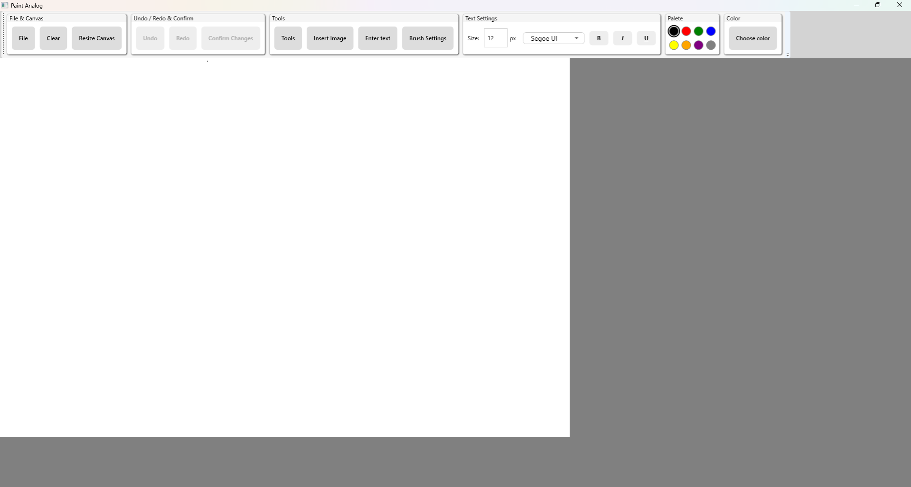
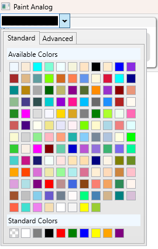
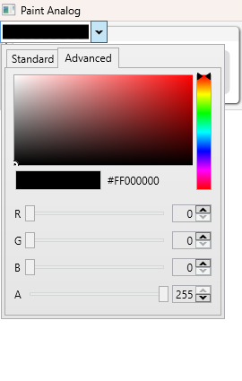
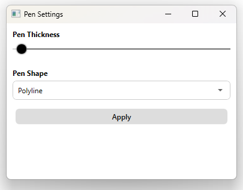
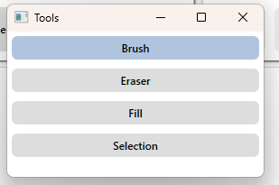

# PaintAnalog

> A lightweight WPF-based drawing application inspired by classic MS Paint.  
> Includes drawing tools, image & text insertion, selection editing, and savestate features.

---

## Table of Contents

- [Project Description](#project-description)
- [Features](#features)
- [Screenshots](#screenshots)
- [Installation and Launch](#installation-and-launch)
- [Controls](#controls)
- [Project Structure](#project-structure)
- [Technologies Used](#technologies-used)
- [Implementation Details](#implementation-details)
- [Future Plans](#future-plans)
- [Author](#author)
- [License](#license)

---

## Project Description

PaintAnalog is a modern reinterpretation of classic MS Paint, designed to offer a cleaner interface and smoother interaction.  
While preserving its original simplicity, the app introduces thoughtful changes to improve usability and overall user experience.  
Familiar concepts have been streamlined or reworked to feel more intuitive in a contemporary context

---

## Features

- **Drawing & Editing** — Freeform brush drawing, image and text insertion with support for resizing, rotation, and styling (font, size, bold, italic, underline)
- **Color & Formatting** — Custom color picker and rich text formatting via toolbar toggles
- **Canvas Management** — Clear canvas, dynamically resize it, and zoom using the mouse wheel
- **Undo / Redo & Confirm** — Revert or apply recent actions, including confirm edits to elements
- **Clipboard Support** — Copy and paste last inserted image using Ctrl+C / Ctrl+V
- **File Operations** — Save and load canvas content using context menu options
- **Extended Toolbox** — Access additional tools and settings through a separate dialog window
- **MVVM Architecture** — Fully data-bound design using `MainViewModel` and command bindings

---

## Screenshots

### Overall view

### Color picker standart/advanced dialogue window

<table cellpadding="8">
  <tr>
    <td></td>
    <td></td>
  </tr>
</table>

### Settings dialogue window example

### Tools menu dialogue window

---

## Installation and Launch

Instructions on how to build and run the application locally will be added in future

---

## Controls

### Hotkeys

| Shortcut        | Action                                |
|----------------|----------------------------------------|
| **Ctrl + Z**   | Undo last action                      |
| **Ctrl + Y**   | Redo last undone action               |
| **Ctrl + S**   | Confirm current changes               |
| **Ctrl + C**   | Copy last inserted image              |
| **Ctrl + V**   | Paste last copied image               |
| **Ctrl + B**   | Toggle bold formatting in text box    |
| **Ctrl + I**   | Toggle italic formatting in text box  |
| **Ctrl + U**   | Toggle underline in text box          |

---

## Project Structure

The solution `PaintAnalog` contains two projects:

### 1. **PaintAnalog** – Main WPF Application  
Organized according to MVVM principles with a clear separation of concerns.

- **Converters/**  
  Contains value converters used in data bindings:  
  - `ColorToVisibilityConverter.cs` — Converts color values to visibility state  
  - `TextSizeConverter.cs` — Converts font size values for UI display

- **ViewModels/**  
  ViewModel layer that handles logic and data binding:  
  - `MainViewModel.cs` — Central logic for application state and UI interaction  
  - `RelayCommand.cs` — Command implementation for MVVM bindings  
  - `ViewModelBase.cs` — Base class for property change notifications

- **Views/**  
  XAML UI definitions for main windows and dialogs:  
  - `MainWindow.xaml` — Main application window  
  - `ToolsWindow.xaml` — Separate toolbox with extended tools  
  - `EraserSettingsWindow.xaml`, `PenSettingsWindow.xaml`, `ResizeCanvasDialog.xaml` — Settings and utility dialogs  
  - `SelectionBox.xaml` — Visual component for selection area

- **App.xaml / AssemblyInfo.cs**  
  Application entry point and assembly metadata

### 2. **AnalogSetup** – Installer/Packaging Project  
- Contains the deployment settings and assets for packaging the app  
- Includes icon resource `a_letter_letters_alphabet_icon_208976.ico` for branding  
- Uses output from `PaintAnalog` as the primary application payload

---

## Technologies Used

List the frameworks, libraries, and design patterns used in the project will be added in future

---

## Implementation Details

Notes on complex or interesting parts of the implementation will be added in future

---

## Future Plans

List any planned features or improvements will be added in future

---

## Author

Merzki

---

## License

This project is licensed under the [MIT License](LICENSE.md).

---