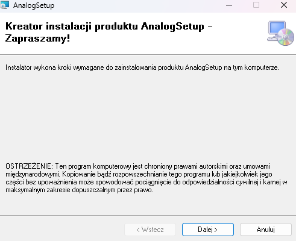

# PaintAnalog

> A lightweight WPF-based drawing application inspired by classic MS Paint  
> Includes drawing tools, image & text insertion, selection editing, and savestate features

---

## Table of Contents

- [Project Description](#project-description)
- [Features](#features)
- [Screenshots](#screenshots)
- [Installation and Launch](#installation-and-launch)
- [Controls](#controls)
- [Project Structure](#project-structure)
- [Technologies Used](#technologies-used)
- [Future Plans](#future-plans)
- [Author](#author)
- [License](#license)

---

## Project Description

PaintAnalog is a modern reinterpretation of classic MS Paint, designed to offer a cleaner interface and smoother interaction.  
While preserving its original simplicity, the app introduces thoughtful changes to improve usability and overall user experience.  
Familiar concepts have been streamlined or reworked to feel more intuitive in a contemporary context

---

## Features

- **Drawing & Editing** — Freeform brush drawing, image and text insertion with support for resizing, rotation, and styling (font, size, bold, italic, underline)
- **Color & Formatting** — Custom color picker and rich text formatting via toolbar toggles
- **Canvas Management** — Clear canvas, dynamically resize it, and zoom using the mouse wheel
- **Undo / Redo & Confirm** — Revert or apply recent actions, including confirm edits to elements
- **Clipboard Support** — Copy and paste last inserted image using Ctrl+C / Ctrl+V
- **File Operations** — Save and load canvas content using context menu options
- **Extended Toolbox** — Access additional tools and settings through a separate dialog window
- **MVVM Architecture** — Fully data-bound design using `MainViewModel` and command bindings

---

## Screenshots

### Overall view


### Color picker standard/advanced dialogue window

<table cellpadding="8">
  <tr>
    <td></td>
    <td></td>
  </tr>
</table>

### Settings dialogue window example


### Tools menu dialogue window


---

## Installation and Launch

This section explains how to clone, build, and run the **PaintAnalog** WPF application locally, as well as how to install it via setup

---

### 🔹 Option 1: Download Installer (Recommended)

You can install **PaintAnalog** directly on your Windows machine by downloading the latest `.exe` installer from the [Releases page](https://github.com/Merzki/PaintAnalog/releases)

1. Go to the [Releases](https://github.com/Merzki/PaintAnalog/releases) section on GitHub
2. Download the `AnalogSetup.msi` and `setup.exe` files, than put it in same folder
3. Run the `setup.exe` 
4. After installation, launch **Analog** via shortcut

#### Installer preview



---

### 🔹 Option 2: Build from Source

#### Prerequisites

Make sure you have the following installed:

- **Windows 10 or 11**
- [.NET 8.0 SDK](https://dotnet.microsoft.com/download/dotnet/8.0)
- **Visual Studio 2022** or newer with the **".NET Desktop Development"** workload

---

#### 1. Clone the repository

```bash
git clone https://github.com/Merzki/PaintAnalog.git
cd PaintAnalog
```

---

#### 2. Restore NuGet packages

```bash
dotnet restore
```

This will install the following NuGet package:

- `Extended.Wpf.Toolkit` version `4.6.1`

---

#### 3. Build the project

```bash
dotnet build
```

Or use Visual Studio and press:

```
Ctrl + Shift + B
```

---

#### 4. Run the application

Using the command line:

```bash
dotnet run --project PaintAnalog
```

Or, in Visual Studio:

1. Open the solution file `PaintAnalog.sln`
2. Set `PaintAnalog` as the startup project
3. Press **F5** to launch the application

---

## Controls

### Hotkeys

| Shortcut        | Action                                |
|----------------|----------------------------------------|
| **Ctrl + Z**   | Undo last action                      |
| **Ctrl + Y**   | Redo last undone action               |
| **Ctrl + S**   | Confirm current changes               |
| **Ctrl + C**   | Copy last inserted image              |
| **Ctrl + V**   | Paste last copied image               |
| **Ctrl + B**   | Toggle bold formatting in text box    |
| **Ctrl + I**   | Toggle italic formatting in text box  |
| **Ctrl + U**   | Toggle underline in text box          |

---

## Project Structure

The solution `PaintAnalog` contains two projects:

### 1. **PaintAnalog** – Main WPF Application  
Organized according to MVVM principles with a clear separation of concerns

- **Converters/**  
  Contains value converters used in data bindings:  
  - `ColorToVisibilityConverter.cs` — Converts color values to visibility state  
  - `TextSizeConverter.cs` — Converts font size values for UI display

- **ViewModels/**  
  ViewModel layer that handles logic and data binding:  
  - `MainViewModel.cs` — Central logic for application state and UI interaction  
  - `RelayCommand.cs` — Command implementation for MVVM bindings  
  - `ViewModelBase.cs` — Base class for property change notifications

- **Views/**  
  XAML UI definitions for main windows and dialogs:  
  - `MainWindow.xaml` — Main application window  
  - `ToolsWindow.xaml` — Separate toolbox with extended tools  
  - `EraserSettingsWindow.xaml`, `PenSettingsWindow.xaml`, `ResizeCanvasDialog.xaml` — Settings and utility dialogs  
  - `SelectionBox.xaml` — Visual component for selection area

- **App.xaml / AssemblyInfo.cs**  
  Application entry point and assembly metadata

### 2. **AnalogSetup** – Installer/Packaging Project  
- Contains the deployment settings and assets for packaging the app  
- Includes icon resource `a_letter_letters_alphabet_icon_208976.ico` for branding  
- Uses output from `PaintAnalog` as the primary application payload

---

## Technologies Used

### Frameworks
- **.NET 8.0 (Windows Desktop)** — the core framework used for building the application
- **WPF (Windows Presentation Foundation)** — used for constructing the graphical user interface (GUI)

### Libraries
- **Extended.Wpf.Toolkit (v4.6.1)** — a third-party library that extends WPF's standard functionality with additional UI controls and utilities
  - Source: [GitHub Repository](https://github.com/xceedsoftware/wpftoolkit)
  - License: [Microsoft Public License (Ms-PL)](https://github.com/xceedsoftware/wpftoolkit/blob/master/license.md)
  - Used for enhanced UI controls and color picker functionality

### Design Patterns
- **MVVM (Model-View-ViewModel)** — the main architectural pattern used:
  - Project structure includes `ViewModels`, `Views` folders, and a base class `ViewModelBase` implementing `INotifyPropertyChanged`
  - Supports separation of concerns between UI and business logic
- **Command Pattern** — implemented using the `RelayCommand` class to bind UI actions to ViewModel logic
- **INotifyPropertyChanged** — used to notify the view about property changes in the ViewModel, which is standard in MVVM
- **Value Converters** — custom converters in the `Converters` folder are used to transform data between the View and the ViewModel (e.g., for formatting or conditional display)

---

## Future Plans

At this stage, the **PaintAnalog** project has reached its completion, serving as the first meaningful milestone in my software development journey.  
No further updates are expected in the near future, as I consider the application to be functionally complete and fully aligned with its intended purpose — a lightweight, intuitive drawing tool.  
While I remain open to revisiting the project if compelling new ideas emerge, its current form reflects a finished product that fulfills all my original goals

---

## Author

Merzki

---

## License

This project is licensed under the [MIT License](LICENSE.md)

---